# Section1. 네트워크의 기초

## 네트워크란?

노드(서버, 라우터, 스위치 등의 네트워크 장치)와 링크(유선/무선)가 서로 연결되어 있거나 연결되어 있지 않은 집합체

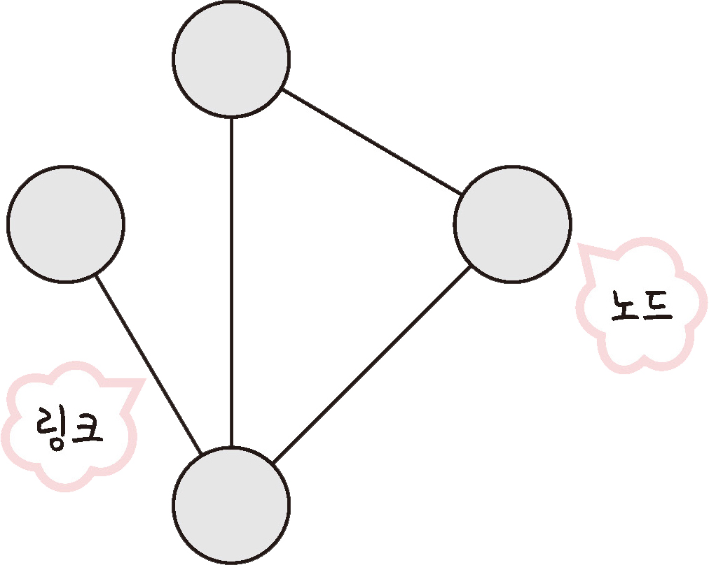

### 2.1.1 처리량과 지연 시간

#### 처리량(throughput)

링크를 통해 전달되는 단위 시간당 데이터 양. 단위는 bps(bits per second)

트래픽, 네트워크 장치 간 대역폭, 에러, 장치의 하드웨어 스펙에 영향을 받음

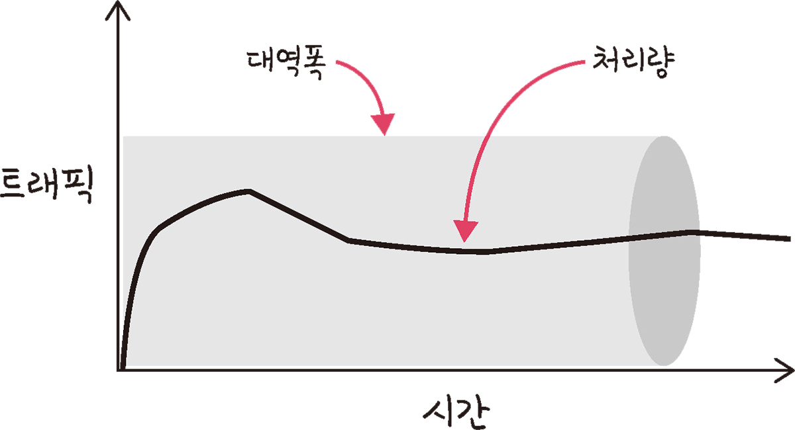

※ 대역폭 : 주어진 시간 동안 네트워크 연결을 통해 흐를 수 있는 최대 비트 수

#### 지연 시간(latency)

요청이 처리되는 시간. 어떤 메시지가 두 장치 사이를 왕복하는데 걸린 시간

매체 타입(무선/유선), 패킷크기, 라우터의 패킷 처리 시간에 영향을 받음

### 2.1.2 네트워크 토폴로지와 병목 현상

#### 네트워크 토폴로지

노드와 링크가 어떻게 배치되어 있는지에 대한 방식, 연결 형태

##### 1) 트리 토폴로지

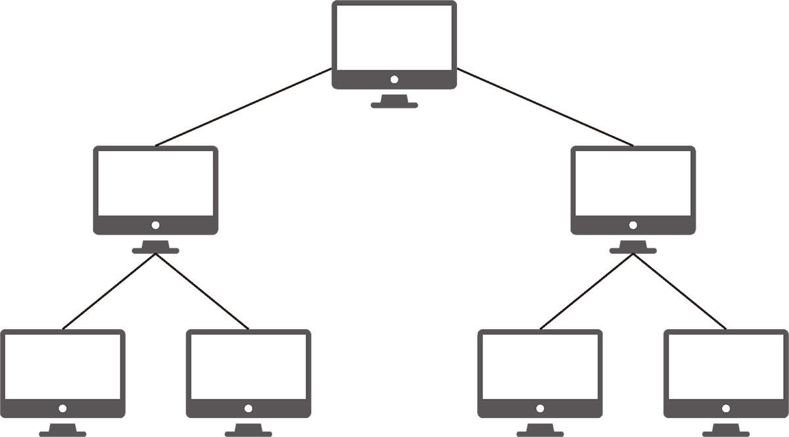

계층형 토폴로지, 트리 형태로 배치한 네트워크 구성

장점 : 노드의 추가/삭제가 쉬움

단점 : 특정 노드에 트래픽이 집중될 경우 하위 노드에 영향을 끼칠 수 있음

##### 2) 버스 토폴로지

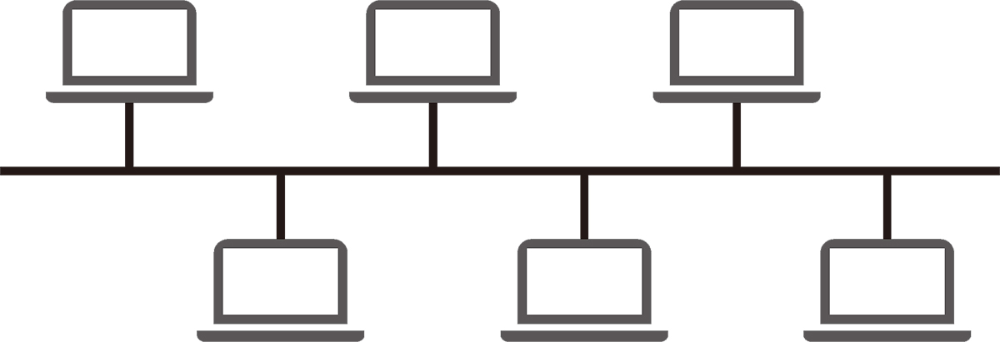

중앙 통신 회선 하나에 여러개의 노드 연결, 근거리 통신망(LAN)에 사용

장점 : 설치 비용↓ 신뢰성↑ 중앙 통신 회선에 노드 추가/삭제 쉬움

단점 : 스푸핑 가능

※ 스푸핑 : 스위칭 기능(LAN상에서 송신부의 패킷을 송신과 관련 없는 다른 호스트에 가지 않도록 하는 기능)을 마비시키거나 속여 특정 노드에 해당 패킷이 오도록 처리하는 것

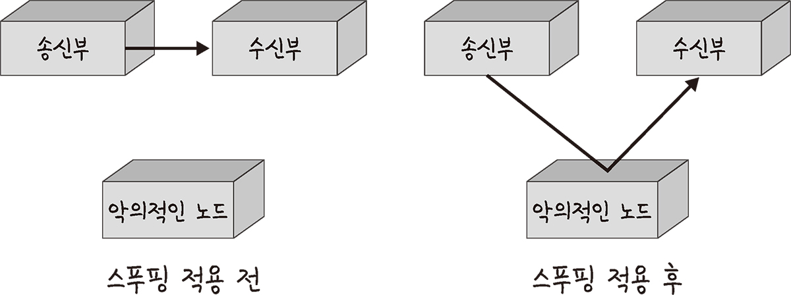

##### 3) 스타 토폴로지

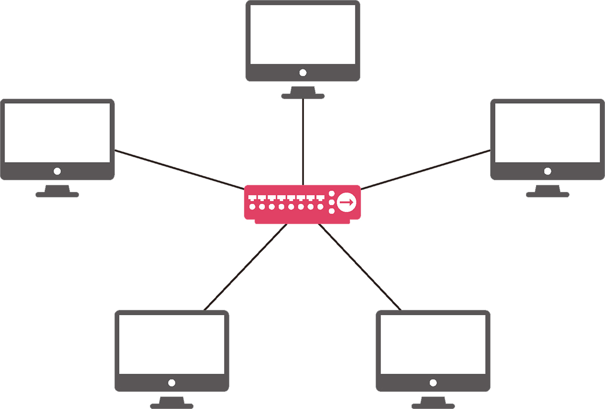

중앙에 있는 노드에 모두 연결 된 네트워크 구성

장점 : 노드 추가/삭제 쉬움. 패킷의 충돌 발생 가능성↓ 어떤 노드에 장애가 발생해도 에러를 쉽게 발견할 수 있음

단점 : 중앙 노드에 장애 발생 시 전체 네트워크 사용 불가, 설치 비용↑

##### 4) 링형 토폴로지

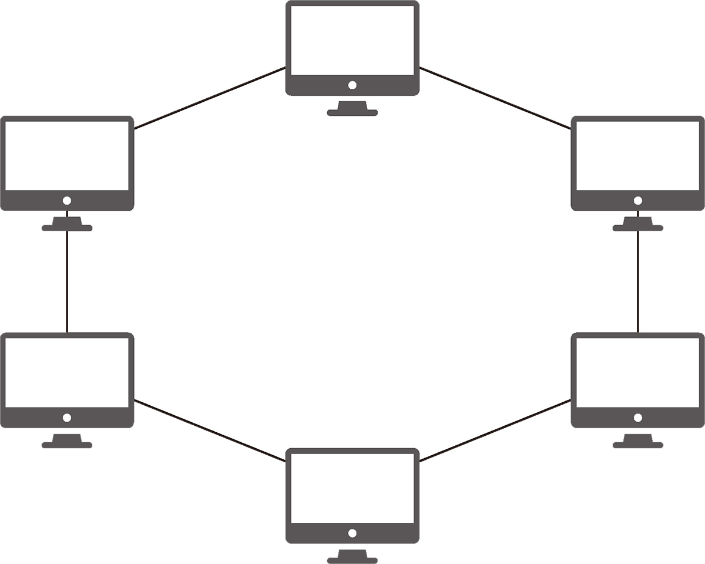

장점 : 노드 수가 증가되어도 네트워크 상 손실이 거의 없음. 충돌 발생 가능성↓ 노드 고장 발견 쉬움

단점 : 네트워크 구성 변경 어려움, 회선에 장애 발생 시 전체 네트워크에 영향

##### 5) 메시 토폴로지

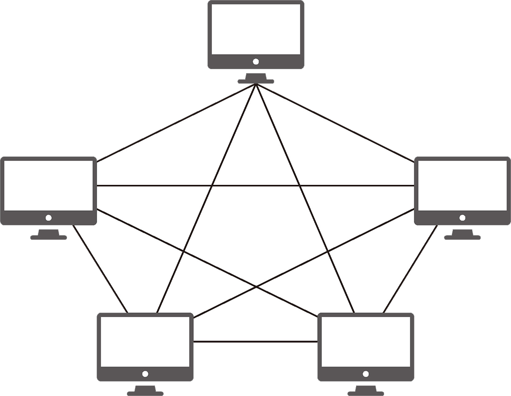

망형 토폴로지, 그물망처럼 연결되어 있는 구조

장점 : 한 단말 장치에 장애가 발생하더라도 네트워크를 계속 사용할 수 있음, 트래픽 분산 처리 가능

단점 : 노드 추가/제거 어려움, 구축/운용 비용↑

#### 병목 현상

전체 시스템의 성능이나 용량이 하나의 구성 요소로 인해 제한을 받는 현상

→ 병목 현상을 찾을 때 토폴로지가 중요한 기준이 되고 이를 해결하는데도 도움이 됨

### 2.1.3 네트워크 분류

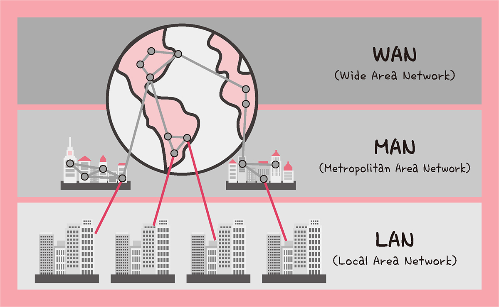

#### LAN

근거리 통신망, 좁은 공간에서 운영되며 전송 속도가 빠르고 혼잡하지 않음

#### MAN

대도시 지역 네트워크, 전송 속도 평균, LAN보다 혼잡함

#### WAN

광역 네트워크, 국가/대륙 등 넓은 지역에서 운영됨, 전송속도 낮고 MAN보다 혼잡

### 2.1.4 네트워크 성능 분석 명령어

#### ping [IP 주소/도메인 주소]

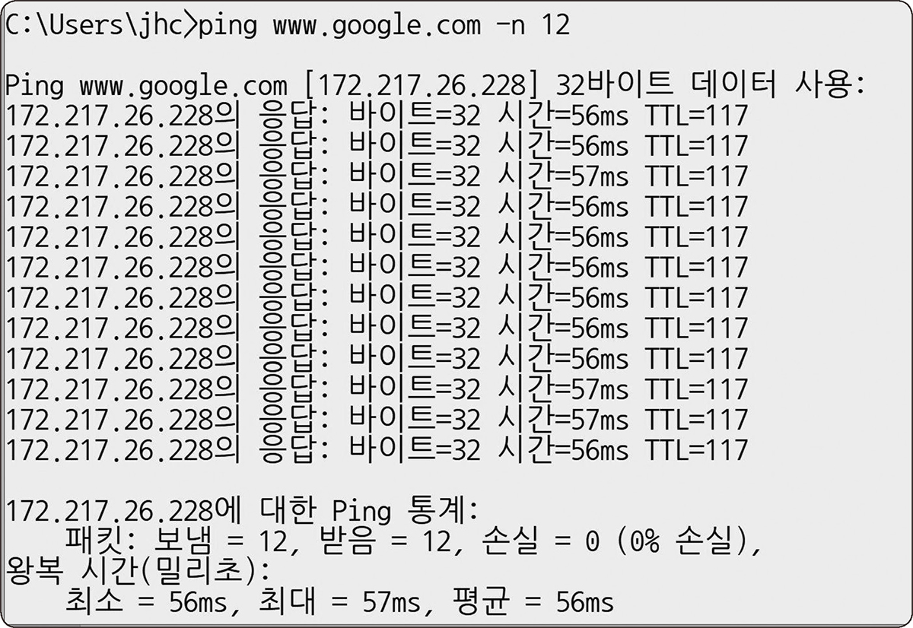

Packet INternet Groper

네트워크 상태를 확인하려는 대상 노드를 향해 일정 크기의 패킷을 전송하는 명령어

TCP/IP 프로토콜 중 ICMP 프로토콜을 통해 동작하므로 이를 지원하지 않는 기기 대상 실행 불가

#### netstat

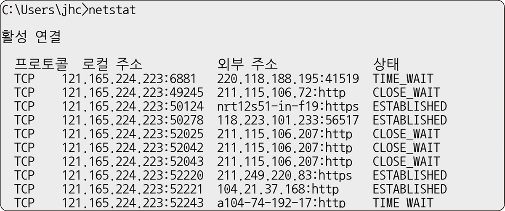

접속된 서비스들의 네트워크 상태 표시

주로 서비스의 포트가 열려있는지 확인할 때 사용

#### nslookup

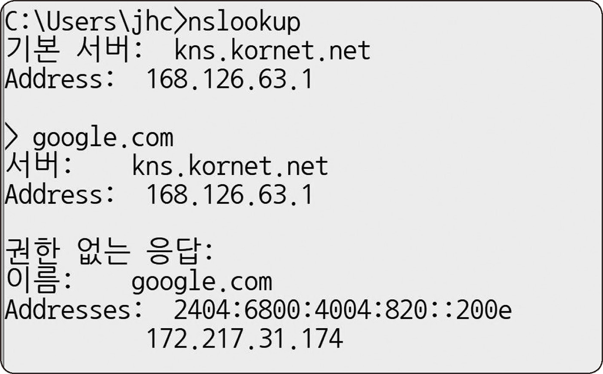

DNS관련된 내용 확인을 위해 사용

특정 도메인에 매핑된 IP 확인

#### tracert(윈도우)/traceroute(리눅스)

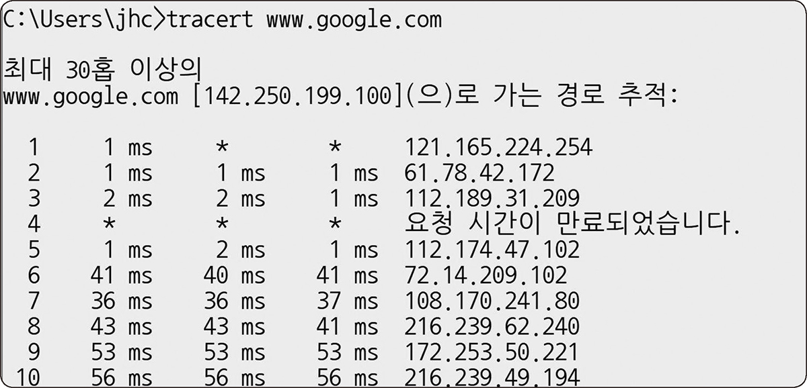

목적지 노드까지 네트워크 경로 확인

어느 구간에서 응답 시간이 느려지는지 확인 가능

### 2.1.5 네트워크 프로토콜 표준화

다른 장치들끼리 데이터를 주고받기 위해 설정된 공통된 인터페이스

IEEE/IETF에서 지정
