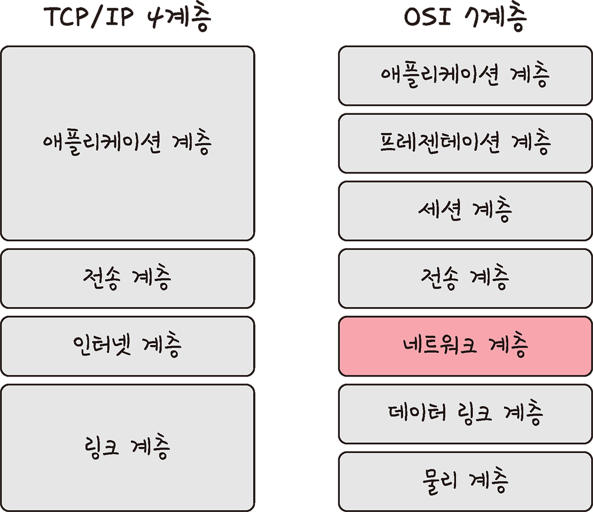
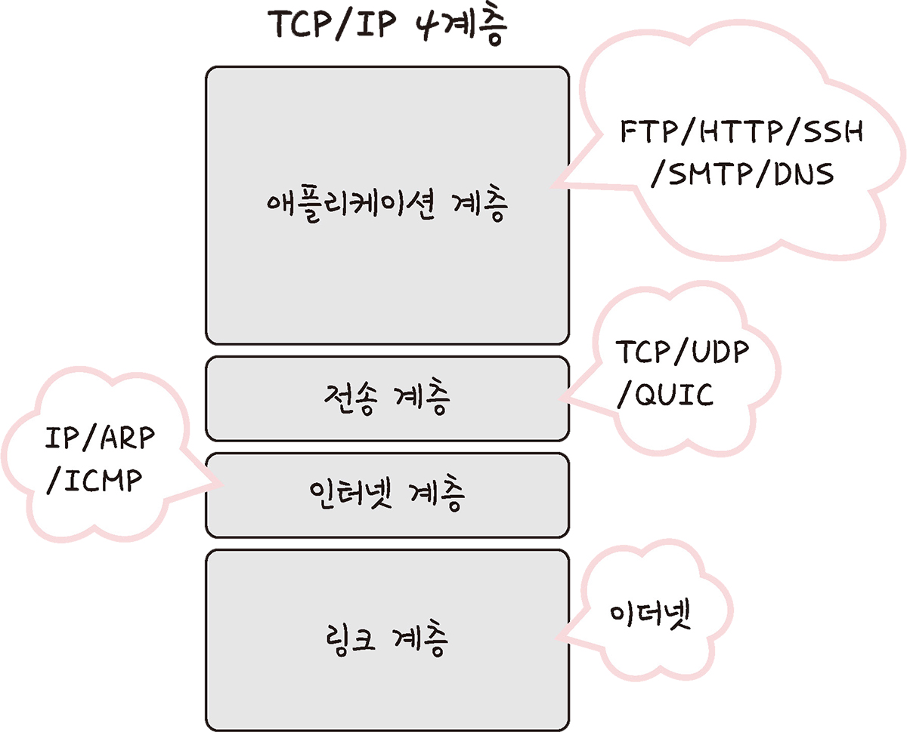
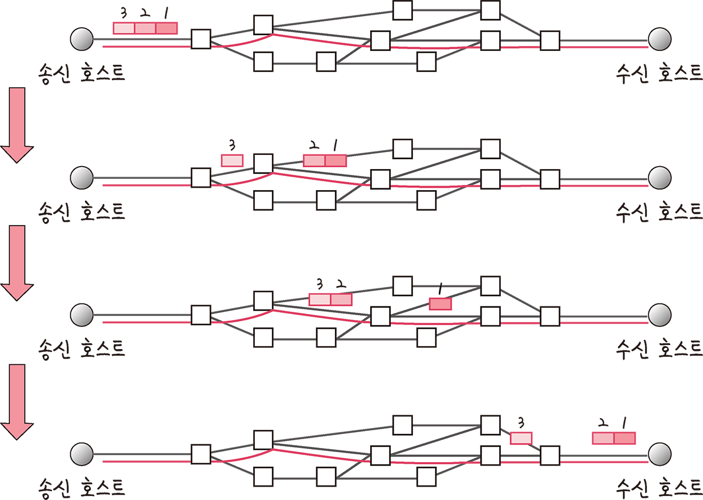
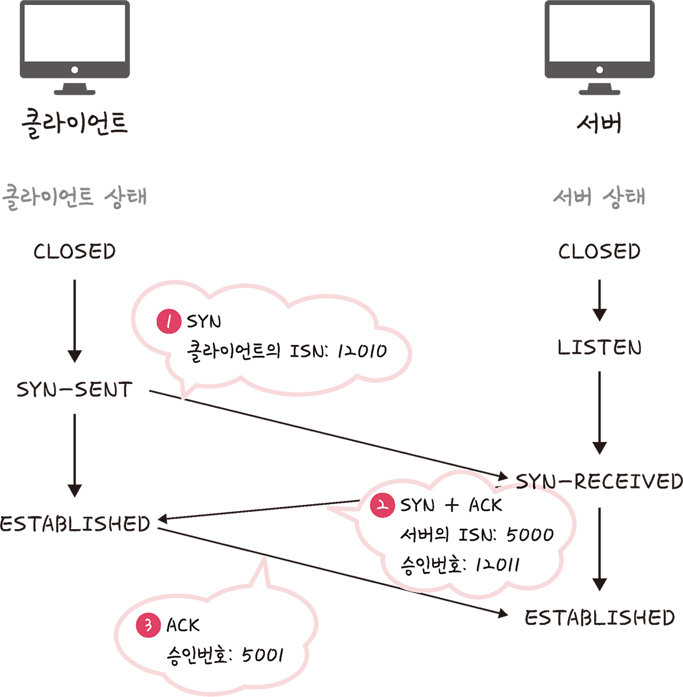
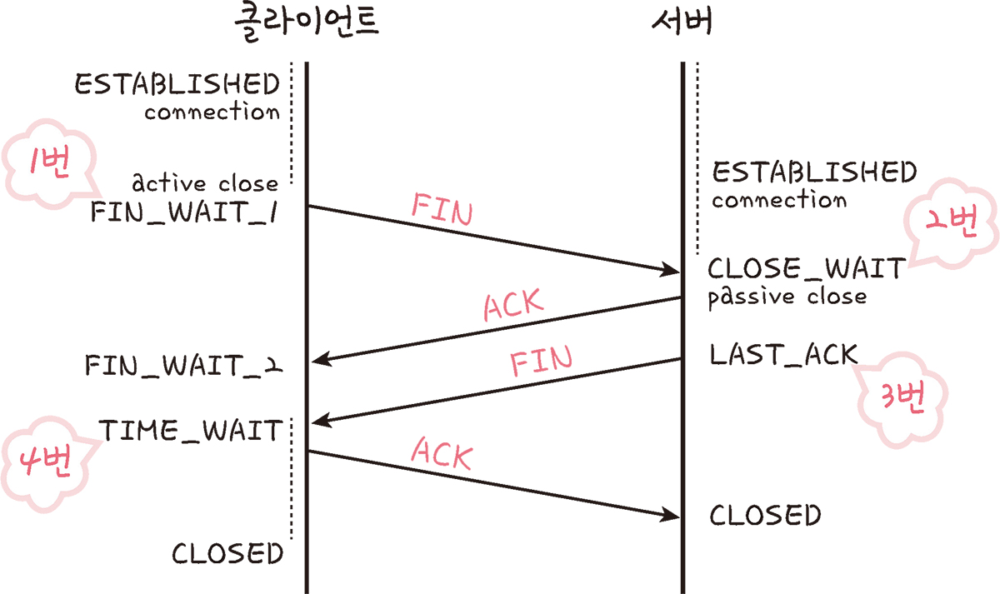
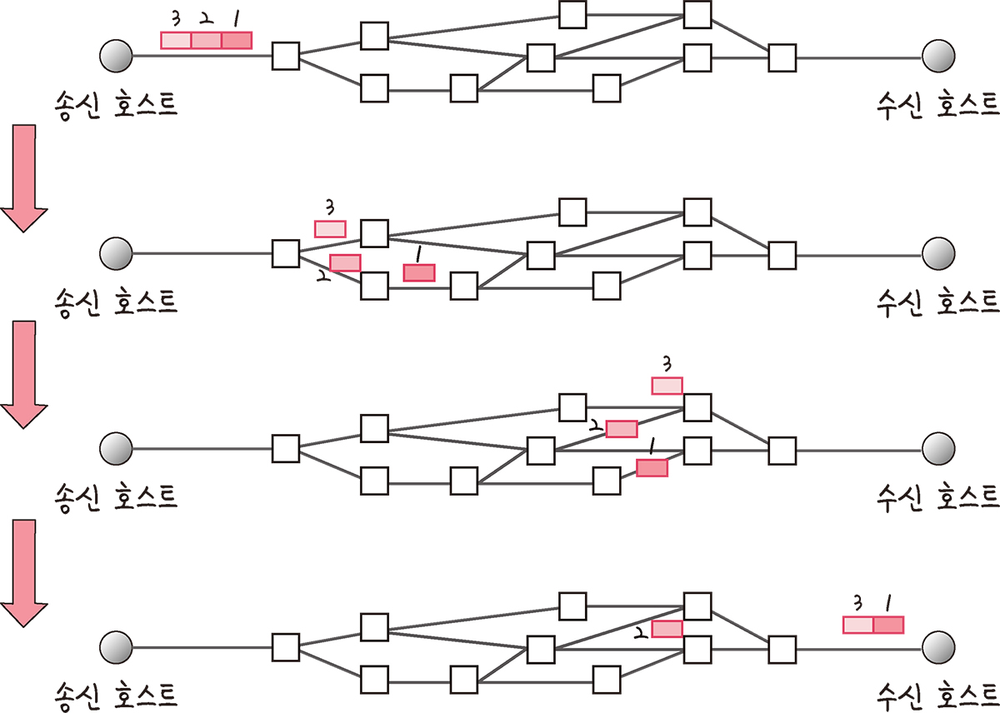

# Section2. TCP/IP 4계층 모델

## Internet Protocol Suite

인터넷에서 컴퓨터들이 서로 정보를 주고받는 데 쓰이는 프로토콜의 집합

TCP/IP 4계층 모델, OSI 7계층 모델

### 2.2.1 계층 구조

특정 계층이 변경되었을 때 다른 계층이 영향을 받지 않도록 설계됨

#### 애플리케이션 계층

FTP/HTTP/SSH/SMTP/DNS 등 응용 프로그램이 사용되는 프로토콜 계층

웹 서비스, 이메일 등 서비스를 실질적으로 사람들에게 제공

※ FTP : 장치 간 파일 전송에 사용되는 표준 통신 프로토콜

※ SSH : 보안되지 않은 네트워크에서 네트워크 서비스를 안전하게 운영하기 위한 암호화 네트워크 프로토콜

※ HTTP : www을 위한 데이터 통신의 기초, 웹사이트를 이용하는데 사용하는 프로토콜

※ SMTP : 전자 메일 전송을 위한 인터넷 표준 통신 프로토콜

※ DNS : 도메인 이름과 IP주소를 매핑해주는 서버

#### 전송계층

TCP/UDP

송신자-수신자 연결하는 통신서비스 제공, 연결 지향 데이터 스트림 지원,

신뢰성, 흐름 제어 제공, 애플리케이션과 인터넷 계층 간 데이터 전달 시 중계 역할

##### 1) TCP

패킷 사이의 **순서 보장**, 연결지향 프로토콜, 신뢰성 구축해 **수신여부 확인**

###### 가상회선 패킷 교환방식

각 패킷에 가상회선 식별자 포함, 모든 패킷 전송 시 가상회선이 해제되고 패킷들은 전송된 순서대로 도착함

###### TCP 연결 성립 과정 : 3-way handshake

1) SYN 단계 : 클라이언트가 서버에 클라이언트의 ISN을 담아 SYN을 보냄
   
   ISN은 새로운 TCP 연결의 첫번째 패킷에 할당된 임의의 시퀀스 번호

2) SYN + ACK 단계 : 서버가 이를 수신하고 서버의 ISN을 보내며 승인번호로 클라이언트의 ISN + 1을 보냄

3) ACK 단계 : 클라이언트가 서버의 ISN + 1값을 승인번호로 담아 ACK를 서버에 보냄

→ 신뢰성 구축. UDP는 이 과정이 없어 신뢰성이 없는 계층이라고 한다.

###### TCP 연결 해제 과정 : 4-way handshake

1. 클라이언트가 연결을 닫으려고 할 때 FIN이라는 세그먼트를 보냄, 클라이언트는 FIN_WAIT_1 상태가 되며 서버의 응답을 기다린다

2. 서버는 클라이언트로 ACK라는 승인 세그먼트를 보낸 후 CLOSE_WAIT 상태가 됨. 클라이언트가 세그먼트를 받으면 FIN_WAIT_2 상태가 된다

3. 서버는 2번 작업 후 일정 시간 이후에 클라이언트에 FIN 세그먼트를 보냄

4. 클라이언트는 **TIME_WAIT** 상태가 되고 다시 서버로 ACK를 보내 서버가 CLOSED 상태가 된다. 이후 어느 정도의 시간을 대기한 클라이언트의 연결이 닫히고 클라이언트와 서버의 모든 자원 연결이 해제됨

※ 지연 패킷이 발생할 경우를 대비하기 위해(데이터 무결성 문제 발생하지 않도록), TIME_WAIT 상태 존재함. CentOS6/우분투는 60초, 윈도우는 4분

##### 2) UDP

**순서 보장 X**, **수신여부 확인X**, 단순히 데이터만 줌

###### 데이터그램 패킷 교환방식

패킷이 독립적으로 이동하며 최적의 경로를 선택

하나의 메시지에서 분할된 여러 패킷이 서로 다른 경로로 전송될 수 있어 도착한 순서가 다를 수 있음

#### 인터넷 계층

IP/ARP/ICMP 등

장치로부터 받은 네트워크 패킷을 IP 주소로 지정된 목적지로 전송하기 위해 사용

상대방이 제대로 받았는지에 대해 보장하지 않는 **비연결형적** 특징

#### 링크 계층

전선/광섬유/무선 등 네트워크 접근계층이라고도 함

실절적으로 데이터 전달하며 장치 간 신호를 주고 받는 규칙을 정하는 계층

#### 계층 간 데이터 송수신 과정

### 2.2.2 PDU

# 
